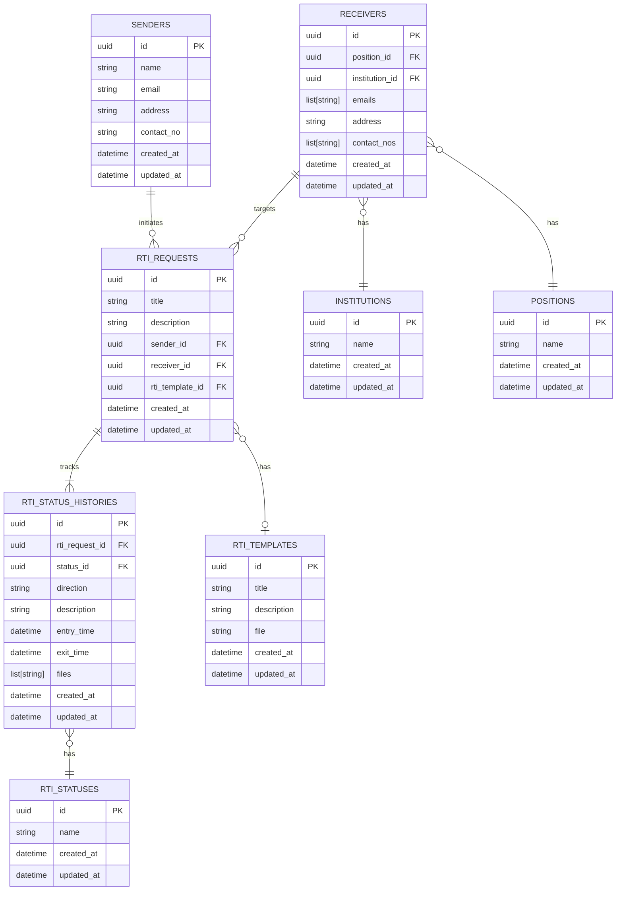

# Database SQL Scripts

This directory contains the SQL scripts used to initialize and seed the RTI-Tracker database.

## Directory Structure

- **`schema.sql`**: The core database structure (tables, extensions, constraints).
- **`seed.sql`**: Mock data for development and testing.

#### DB Schema



## Local Development

To reset your local database and apply fresh schema/seed data, run:

#### Environment setup

**macOS / Linux**

```bash
cp .env.example .env
```

**Windows (PowerShell)**

```powershell
Copy-Item .env.example .env
```

**Windows (Command Prompt)**

```cmd
copy .env.example .env
```

- Edit `.env` and fill in your values before running Docker Compose.
- Docker Compose reads `.env` automatically — no need to `source` it.

```bash
docker compose down -v && docker compose up --build
```

_Note: The `-v` flag is required to clear the named volume and trigger re-initialization._

## Production

For production environments (like Neon):

1. Execute **`schema.sql`** to set up the tables.
2. **Do not** run `seed.sql` unless you specifically need mock data in a staging environment.
